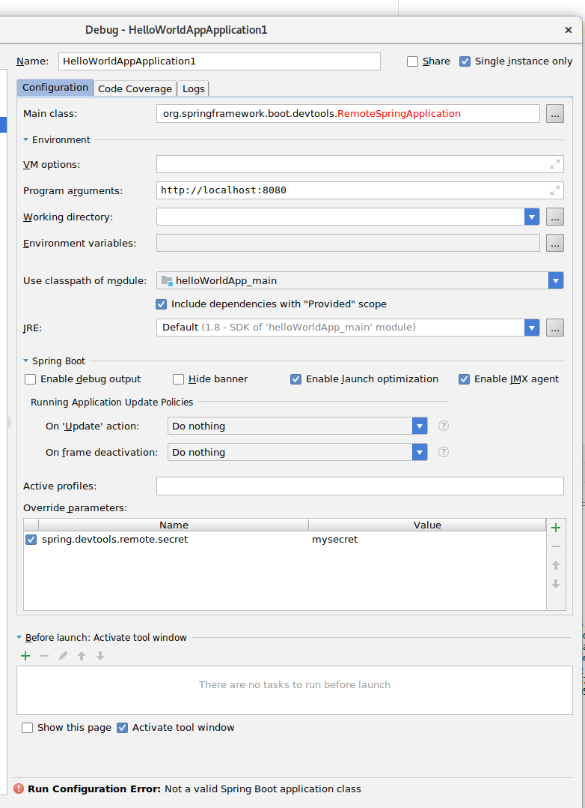

= motdApp

A message of the day app.

* Json Data from https://www.forbes.com/forbesapi/thought/uri.json?enrich=true&query=10&relatedlimit=10[forbes] to provide dummy data
* Using Caching to rotate the message every 24h
** Providing an integration test for rotation logic
** Necessary for distributed caching showcase later on

= Lombok

https://medium.com/@mladen.bolic/lombok-data-improve-your-code-coverage-a74fb624a72b

= Dockerize the App

Use the gradle plugin https://bmuschko.github.io/gradle-docker-plugin/#spring_boot_application_plugin[gradle-docker-plugin]  it has some build-in features for spring boot applications

Configure it via:
----
docker {
    springBootApplication {
        baseImage = 'openjdk:8-alpine'
        ports = [9091, 8080]
    }
}
----

Execute gradle:
----
./gradlew clean dockerBuildImage
----

A local docker image is created check it via:
----
# docker images | grep motd

----

Run the container via
----
# docker run -d -p 8080:8080 --name motdapp -it com.pipiobjo.microservice/motdapp:0.0.1-snapshot && docker logs -f motdapp
----

List running container
----
# docker container ls -a | grep motd
148447f6e1fe        com.pipiobjo.microservice/motdapp:0.0.1-snapshot   "java -jar /app/hell…"   About a minute ago   Exited (130) About a minute ago                       motdapp

----

Logging output of the container:
----
# docker logs -f motdapp
----

Stopping the container:
----
docker stop motdapp
docker rm motdapp
----

Using remote debugging:
----
docker run -d -e "JAVA_OPTS=’-agentlib:jdwp=transport=dt_socket,address=5005,server=y,suspend=n’" -p 8081:8080 -p 5006:5005 --name motdapp -it com.pipiobjo.microservice/motdapp:0.0.1-snapshot
----

Connect to the running container via bash
----
docker exec -i -t motdapp /bin/bash
----

# Hotreload to Docker via spring-boot-devtools

## Adjust the application.yml

----

spring.devtools.remote.secret: mysecret

----

## IntelliJ Run / Debug Config

- New Spring Boot Run Config
- Main Class org.springframework.boot.devtools.RemoteSpringApplication
- Program args: http://localhost:8081 -> the forwarded docker port
- Run parameters need the additional "spring.devtools.remote.secret= mysecret" settings
- Rebuild module, depends on your IDE Eclipse use automatic build on changes

Now you can change your code and it is automatically redeployed into the docker container

----

INFO 30668 --- [   File Watcher] o.s.b.d.r.c.ClassPathChangeUploader      : Uploaded 6 class resources
INFO 30668 --- [pool-1-thread-1] o.s.b.d.r.c.DelayedLiveReloadTrigger     : Remote server has changed, triggering LiveReload

----

[NOTE]
====
I'm not sure if its a good idea to include the spring-boot-dev-tools in the jar.
Production envs will also have the jar and thats maybe an security issue, even if
spring.application.devtools.remote.secret property is not set for the production profile

====
